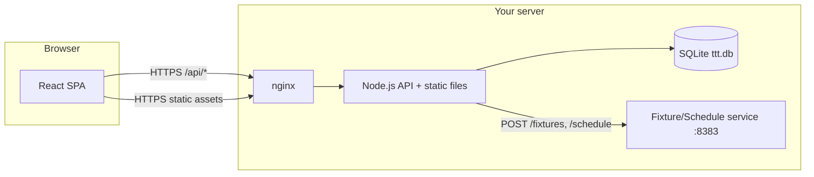
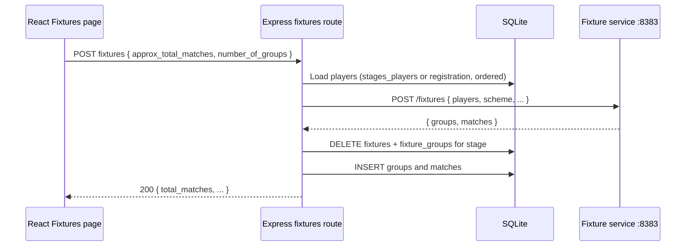

# Table Tennis Tournament — Architecture

Proposed system architecture for the TT tournament management app. Requirements: [prd.md](prd.md). Repository layout and database model: [DESIGN.md](DESIGN.md).

This document defines **how the system is structured**, **how components interact**, and **how it is deployed** on a self-hosted server behind nginx.

---

## Goals and constraints

| Goal | Approach |
|------|----------|
| Single-operator deployment | One Node.js process serves API + static SPA; SQLite file on disk |
| TypeScript everywhere | Shared types in `packages/shared`; strict TS in `apps/api` and `apps/web` |
| Mobile-friendly SPA | React + responsive layout; no native apps |
| Real-world tournament ops | Admin override paths; destructive actions require confirmation |
| Testable business logic | Leaderboard and score validation live in the backend; external fixture/schedule services are thin HTTP clients |

**Out of scope for v1:** multi-role per user, CSV import UI, user-management screens, horizontal scaling, managed cloud services.

---

## System context

The app is the central hub for tournament data. Fixture generation and match scheduling are delegated to an **external HTTP service** (already running at `http://localhost:8383` per the PRD). The Node API proxies requests to that service and persists the results in SQLite.



---

## Architectural style

**Modular monolith** — one deployable Node process, clear internal layers, no microservices beyond the existing fixture/schedule helper.

| Layer | Location | Responsibility |
|-------|----------|----------------|
| Presentation | `apps/web` | React SPA, routing, forms, role-based UI, client-side validation |
| API | `apps/api/routes` | HTTP endpoints, auth, request validation, status codes |
| Application | `apps/api/services` | Orchestration: fixture client, schedule client, leaderboard engine |
| Data access | `apps/api/db/repositories` | SQL via `better-sqlite3`; no ORM in v1 |
| Shared kernel | `packages/shared` | DTO types, role constants, score validation rules |

```text
Browser (React)
    │  JSON /api/*
    ▼
Express routes  →  middleware (auth, roles, errors)
    │
    ▼
Services        →  external HTTP (fixtures, schedule)
    │              →  pure functions (leaderboard, score parse)
    ▼
Repositories    →  better-sqlite3  →  data/ttt.db
```

**Why no ORM:** The schema is small, stable, and already defined in SQL ([scripts/create_db.sh](../scripts/create_db.sh)). Repositories keep queries explicit and easy to test. An ORM can be introduced later if migrations become burdensome.

---

## Technology stack

| Concern | Choice | Notes |
|---------|--------|-------|
| Language | TypeScript 5.x | Monorepo workspaces (npm or pnpm) |
| Backend runtime | Node.js 20+ LTS | Single `index.ts` entry |
| HTTP framework | Express | Minimal, well understood, easy behind nginx |
| Database | SQLite 3 | File at `data/ttt.db`; WAL mode; `foreign_keys = ON` |
| DB driver | `better-sqlite3` | Synchronous API suits low-concurrency tournament use |
| Frontend | React 18+ | SPA with React Router |
| Build (web) | Vite | Fast dev; `dist/` emitted for production static hosting |
| Validation | Zod | Request bodies (API) and shared score rules (`@ttt/shared`) |
| Auth | `express-session` + `bcrypt` | Cookie-based sessions; passwords hashed at rest |
| Styling | Tailwind CSS (recommended) | Responsive tables and forms for mobile/tablet/laptop |
| Testing | Vitest | Unit tests for services/validation; API integration tests with in-memory or temp DB |

Repository tree and workspace scripts are specified in [DESIGN.md](DESIGN.md).

---

## Runtime processes

### Development

Two processes during development (via root `pnpm dev`):

1. **API** — `apps/api` on `PORT` (default `3000`)
2. **Web** — Vite dev server with proxy to `/api`

### Production

**One Node process** is sufficient:

1. Build: `shared` → `api` → `web` (`apps/web/dist`)
2. API serves:
   - `/api/*` — JSON REST handlers
   - `/*` — static files from `apps/web/dist` (SPA fallback to `index.html`)

No separate CDN or app server is required. The fixture/schedule service on port `8383` runs independently (same host or reachable URL via `FIXTURE_SERVICE_URL`).

---

## Deployment behind nginx

nginx terminates TLS and reverse-proxies to the Node process. SQLite stays on the same machine as the API (file path `DB_PATH`).

```text
Internet
   │
   ▼
nginx :443
   │  proxy_pass http://127.0.0.1:3000
   ▼
node apps/api/dist/index.js
   ├── /api/*     → Express routers
   └── /*         → apps/web/dist (React build)
```

**Example nginx location block:**

```nginx
server {
    listen 443 ssl;
    server_name tt.example.com;

    location / {
        proxy_pass http://127.0.0.1:3000;
        proxy_http_version 1.1;
        proxy_set_header Host $host;
        proxy_set_header X-Real-IP $remote_addr;
        proxy_set_header X-Forwarded-For $proxy_add_x_forwarded_for;
        proxy_set_header X-Forwarded-Proto $scheme;
    }
}
```

**Process supervision:** Use `systemd`, `pm2`, or similar to keep the Node process running and restart on failure.

**Environment (production):**

| Variable | Example | Purpose |
|----------|---------|---------|
| `NODE_ENV` | `production` | Disable dev tooling |
| `PORT` | `3000` | Listen address for nginx upstream |
| `DB_PATH` | `/var/lib/ttt/ttt.db` | Absolute path recommended in prod |
| `SESSION_SECRET` | random 32+ bytes | Session cookie signing |
| `FIXTURE_SERVICE_URL` | `http://127.0.0.1:8383` | External fixture/schedule service |
| `TRUST_PROXY` | `1` | Honor `X-Forwarded-*` from nginx |

**Backups:** Copy `ttt.db` (and `-wal`/`-shm` if present) while the app is running (SQLite WAL allows hot copy) or during a brief maintenance window.

---

## Authentication and authorization

### Model

- Username/password login; passwords stored **hashed** (bcrypt) in `users` table
- Users created by **direct DB insert** (no admin UI in v1)
- One role per user: `superadmin` | `admin` | `scorer` | `guest`
- Session cookie (`httpOnly`, `secure` in production, `sameSite=lax`)

### Role hierarchy

Each role inherits permissions of roles below it:

```text
superadmin → tournaments CRUD + all admin capabilities
admin      → stages, registration, fixtures, schedule, move players, score override
scorer     → record scores, mark match over
guest      → read-only players, matches, scores, leaderboard
```

### Enforcement

| Where | Mechanism |
|-------|-----------|
| API | `requireAuth` + `requireRole(...)` middleware on routes |
| Web | Route guards hide menus and redirect unauthorized users |
| Scores | Backend rejects scorer updates when `fixtures.is_completed = 1`; admin may still edit |

Future multi-role support: add `user_roles(user_id, role, tournament)` without removing `users.role` ([DESIGN.md](DESIGN.md)).

---

## API design

REST-style JSON under `/api`. All tournament-scoped routes use `tournament` slug; stage-scoped routes add `stage` slug.

### Conventions

- **Success:** `200` with JSON body; `201` on create where useful
- **Validation:** `400` with `{ error: string, fields?: Record<string, string> }`
- **Auth:** `401` unauthenticated; `403` insufficient role
- **Not found:** `404` for missing tournament/stage/match
- **Conflict / business rule:** `409` (e.g. schedule without fixtures)

### Endpoint map (v1)

| Method | Path | Role | Purpose |
|--------|------|------|---------|
| POST | `/api/auth/login` | public | Create session |
| POST | `/api/auth/logout` | auth | Destroy session |
| GET | `/api/auth/me` | auth | Current user + role |
| GET/POST/PUT/DELETE | `/api/tournaments` | superadmin | Tournament CRUD |
| GET | `/api/tournaments/:slug/registration` | guest+ | List players |
| PUT | `/api/tournaments/:slug/registration` | admin+ | Replace player list (30 rows) |
| GET/POST/PUT/DELETE | `/api/tournaments/:slug/stages` | admin+ | Stage CRUD |
| GET | `/api/tournaments/:slug/stages/:stage/players` | admin+ | Resolved player source (registration vs moved) |
| POST | `/api/tournaments/:slug/stages/:stage/fixtures` | admin+ | Call external service; replace fixtures |
| POST | `/api/tournaments/:slug/stages/:stage/schedule` | admin+ | Call external service; update slots |
| GET/PATCH | `/api/tournaments/:slug/stages/:stage/matches` | guest+ / scorer+ | List/filter matches; patch scores |
| POST | `/api/tournaments/:slug/stages/:stage/matches/:slno/complete` | scorer+ | Match over |
| GET | `/api/tournaments/:slug/stages/:stage/leaderboard` | guest+ | Computed rankings |
| POST | `/api/tournaments/:slug/stages/:stage/move-players` | admin+ | Move selected players to target stage |

Full request/response shapes: [API.md](API.md). Types originate in `@ttt/shared`.

---

## Key data flows

### Fixture generation



Re-run shows a confirmation dialog in the UI; API performs full replace for that stage.

### Scheduling

Same pattern: UI → API → external `POST /schedule` → API updates `table_num` and `hour_slot` on existing `fixtures` rows (overwrite).

### Scoring

- **List:** GET matches sorted by `hour_slot`, then `table_num`; filters applied server-side or via query params
- **Update:** PATCH single match fields (`game1`…`game5`, `walkover_win`); validate with shared score rules
- **Mutual exclusion:** walkover vs game scores enforced in API and UI
- **Match over:** POST sets `is_completed = 1`; scorer locked out afterward

### Leaderboard

Computed on each GET in `leaderboard` service — no cached columns in DB:

1. Load all `fixtures` for `(tournament, stage)`
2. For each player, derive `relative_scores` per match
3. Compute wins, SWLR, PWLR, NRR = `(SWLR * 100) + PWLR`
4. Sort by wins desc, then NRR desc; assign rank

UI auto-refreshes every 5 minutes; manual refresh button re-fetches.

### Move players to next stage

Admin selects players from leaderboard view → chooses target stage → confirmation → API deletes all `stages_players` for target stage and inserts selected players with `sort_order`.

---

## Frontend architecture

### Routing

Tournament-first navigation: most modules show a **tournament picker**, then stage **tabs** where applicable (fixtures, schedule, scores, leaderboard, move players).

```text
/login
/tournaments                    (superadmin)
/tournaments/:slug/registration
/tournaments/:slug/stages
/tournaments/:slug/fixtures     (+ stage tab)
/tournaments/:slug/schedule     (+ stage tab)
/tournaments/:slug/scores       (+ stage tab)
/tournaments/:slug/leaderboard  (+ stage tab)
/tournaments/:slug/move-players (+ stage tab, admin only)
```

### State and API access

- Thin `api/client.ts` wrapper: attaches credentials, parses errors, surfaces backend messages to a **global error banner** (PRD requirement)
- Field-level validation errors rendered adjacent to inputs
- No global state library required for v1; React state + context for auth/session is enough
- Leaderboard page: `setInterval` 5 min + manual refresh

### Responsive UI

- Data-heavy screens (scores, leaderboard) use horizontally scrollable tables on narrow viewports
- Score entry: inline table editing plus modal popup for comfortable mobile entry (per PRD)

---

## Error handling

| Layer | Behavior |
|-------|----------|
| API validators (Zod) | `400` + field map for form errors |
| API services | Throw typed errors → `error-handler` middleware → consistent JSON |
| External fixture service | Timeout/network errors → `502` with clear message; no partial DB writes (use transactions) |
| React | Top-of-page alert for API errors; inline for validation; confirm modals for destructive actions |

Destructive actions (re-create fixtures, re-schedule, move players) always require explicit UI confirmation before calling the API.

---

## Data integrity

- **Transactions:** Fixture creation, registration save, and move-players wrap delete+insert in a single SQLite transaction
- **Foreign keys:** Enforced at DB level; cascade deletes from `tournament` and `stages`
- **Ordering:** `sort_order` on `registration` and `stages_players` preserved for external service input
- **Idempotency:** Re-run endpoints are intentionally destructive but predictable (documented in UI warnings)

---

## Security considerations

| Topic | Mitigation |
|-------|------------|
| Passwords | bcrypt hashes only; never log credentials |
| Sessions | `httpOnly` cookie; rotate `SESSION_SECRET` on deploy |
| CSRF | Same-site cookies + same-origin SPA; optional CSRF token if cross-origin later |
| SQL injection | Parameterized queries in repositories |
| XSS | React default escaping; sanitize any rich text if added later |
| nginx | TLS termination; rate-limit `/api/auth/login` if exposed publicly |

The fixture service should not be exposed to the public internet; bind to localhost or restrict via firewall.

---

## Observability and operations

- **Logging:** Structured JSON or plain text to stdout (nginx/systemd journal)
- **Health:** `GET /api/health` → `{ ok: true, db: "connected" }` for monitoring
- **Migrations:** Schema changes via updated `scripts/create_db.sh`; for production evolution, add numbered SQL migration files under `scripts/migrations/`

---

## Testing strategy (architecture-level)

| Target | Approach |
|--------|----------|
| Score validation, leaderboard math | Pure unit tests in `apps/api` (and shared package) |
| Repositories | Integration tests against temp SQLite file |
| HTTP routes | Supertest against Express app with test DB |
| React forms | Vitest + React Testing Library for validation UX |
| External service | Mock HTTP client in tests; optional contract test against real `:8383` in CI |

Detailed cases belong in `TESTPLAN.md` (future phase per [dev_flow.md](dev_flow.md)).

---

## Build and release checklist

1. `pnpm install` (or `npm install`) at repo root
2. `pnpm db:init` — create `data/ttt.db` if missing
3. Insert hashed users into `users` (script or manual SQL)
4. `pnpm build` — produces `apps/api/dist` and `apps/web/dist`
5. Set production `.env` on server
6. Start Node: `node apps/api/dist/index.js`
7. Configure nginx `proxy_pass` to `PORT`
8. Ensure fixture/schedule service is running at `FIXTURE_SERVICE_URL`

---

## Evolution paths

| Need | Direction |
|------|-----------|
| More traffic | Read replicas not applicable to SQLite; consider Postgres migration if concurrent writers grow |
| CSV player import | New upload endpoint + parser; same `registration` replace semantics |
| Multi-role / per-tournament ACL | `user_roles` junction table; middleware checks `(role, tournament)` |
| API consumers | Add OpenAPI spec generated from Zod schemas |
| Separate frontend hosting | Serve `web/dist` from nginx directly; API only on `/api` |

---

## Document map

| Document | Contents |
|----------|----------|
| [prd.md](prd.md) | Product requirements and business rules |
| [DESIGN.md](DESIGN.md) | Repo layout, DB schema, indexes, lifecycle |
| **ARCHITECTURE.md** (this file) | System structure, deployment, flows, stack |
| [API.md](API.md) | HTTP methods, query params, request/response JSON |
| [dev_flow.md](dev_flow.md) | Phased implementation plan |
| [UI.md](UI.md) | Menus, browser routes, screens, API per screen |
| SW.md (future) | Exact dependency versions |
| TESTPLAN.md (future) | Test cases |

---

## Summary

The proposed architecture is a **TypeScript monorepo** with a **React SPA** and **Express API** in one **Node.js process**, **SQLite** for persistence, and an **external fixture/schedule HTTP service**. nginx on your server handles TLS and proxies to Node; no container orchestration or cloud services are required. Business rules (scores, leaderboard, roles) stay in the backend; the frontend focuses on tournament workflows, confirmations, and clear error display.