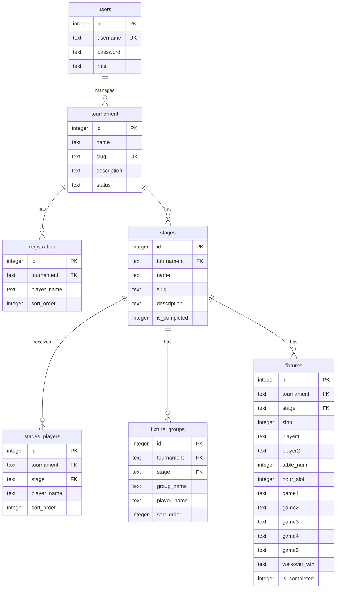

# Table Tennis Tournament — Design

Design document for the TT tournament management app. Source requirements: [prd.md](prd.md).

This document defines the **repository layout** and **SQLite database model**. Backend API specs and UI specs will be added in later design phases (see [flow.md](flow.md)).

## Repository structure

Proposed layout for a TypeScript monorepo. **Not created yet** — review and scaffold manually.

### Principles

| Area | Choice |
|------|--------|
| Layout | npm/pnpm **workspaces** monorepo |
| Backend | `apps/api` — Node.js + Express, TypeScript |
| Frontend | `apps/web` — React SPA, TypeScript, Vite |
| Shared code | `packages/shared` — API types, constants, shared validation |
| Documentation | `docs/` — product and engineering docs |
| Setup & ops | `scripts/` — DB init and other shell tooling |
| Runtime data | `data/` — SQLite file (gitignored) |
| Config | Root tooling configs + per-app `tsconfig`; env via `.env` / `.env.example` |

### Tree

```text
ttt/
├── README.md                         # Project overview, quick start
├── package.json                      # Workspace root (scripts, devDependencies)
├── pnpm-workspace.yaml               # Workspace packages (use npm workspaces if preferred)
├── tsconfig.base.json                # Shared TS compiler options
├── eslint.config.js                  # Root ESLint (flat config)
├── .prettierrc                       # Formatting
├── .gitignore
├── .env.example                      # Documented env vars (no secrets)
│
├── docs/                             # Documentation
│   ├── prd.md                        # Product requirements (move from root)
│   ├── DESIGN.md                     # This file (move from root)
│   ├── flow.md                       # Build phases (move from root)
│   ├── UI.md                         # Screens & menus
│   ├── SW.md                         # Stack & dependencies (future)
│   └── TESTPLAN.md                   # Test plan (future)
│
├── scripts/                          # Setup & maintenance
│   ├── create_db.sh                  # SQLite init (move from root)
│   └── seed_users.sh                 # Optional: insert hashed users (future)
│
├── data/                             # Runtime data (gitignored except .gitkeep)
│   ├── .gitkeep
│   └── ttt.db                        # Created by create_db.sh
│
├── apps/
│   ├── api/                          # Backend (TypeScript)
│   │   ├── package.json
│   │   ├── tsconfig.json             # Extends ../../tsconfig.base.json
│   │   ├── .env.example              # API-specific overrides
│   │   ├── src/
│   │   │   ├── index.ts              # Entry: start HTTP server
│   │   │   ├── app.ts                # Express app wiring
│   │   │   ├── config/
│   │   │   │   └── env.ts            # Typed env (PORT, DB_PATH, FIXTURE_SERVICE_URL)
│   │   │   ├── db/
│   │   │   │   ├── connection.ts     # better-sqlite3 singleton
│   │   │   │   └── repositories/     # One module per table / aggregate
│   │   │   ├── middleware/
│   │   │   │   ├── auth.ts           # Session / basic auth
│   │   │   │   ├── error-handler.ts
│   │   │   │   └── require-role.ts
│   │   │   ├── routes/
│   │   │   │   ├── index.ts          # Mount all routers under /api
│   │   │   │   ├── auth.ts
│   │   │   │   ├── tournaments.ts
│   │   │   │   ├── registration.ts
│   │   │   │   ├── stages.ts
│   │   │   │   ├── fixtures.ts
│   │   │   │   ├── schedule.ts
│   │   │   │   ├── scores.ts
│   │   │   │   ├── leaderboard.ts
│   │   │   │   └── move-players.ts
│   │   │   ├── services/
│   │   │   │   ├── fixture-client.ts # POST localhost:8383/fixtures
│   │   │   │   ├── schedule-client.ts
│   │   │   │   └── leaderboard.ts    # Wins, SWLR, PWLR, NRR
│   │   │   ├── validators/           # Request/body validation (e.g. zod)
│   │   │   └── utils/
│   │   └── tests/
│   │       ├── unit/
│   │       └── integration/
│   │
│   └── web/                          # Frontend SPA (TypeScript)
│       ├── package.json
│       ├── tsconfig.json
│       ├── vite.config.ts            # Dev server + API proxy to apps/api
│       ├── index.html
│       ├── public/
│       │   └── favicon.ico
│       └── src/
│           ├── main.tsx              # Entry
│           ├── App.tsx
│           ├── api/
│           │   └── client.ts         # Typed fetch wrapper
│           ├── components/
│           │   ├── ui/               # Buttons, tables, form fields, errors
│           │   └── layout/           # Nav, shell, tournament/stage pickers
│           ├── hooks/
│           │   └── use-auth.ts
│           ├── pages/
│           │   ├── Home.tsx
│           │   ├── Login.tsx
│           │   ├── tournaments/
│           │   ├── registration/
│           │   ├── stages/
│           │   ├── fixtures/
│           │   ├── schedule/
│           │   ├── scores/
│           │   ├── leaderboard/
│           │   └── move-players/
│           ├── routes/
│           │   └── index.tsx         # React Router routes + role guards
│           ├── styles/
│           │   └── globals.css       # Tailwind entry (see SW.md)
│           └── types/                # Re-exports from @ttt/shared where possible
│       └── tests/
│           ├── unit/                 # Vitest + React Testing Library
│           │   ├── components/
│           │   ├── hooks/
│           │   └── api/              # client.ts, error handling
│           └── integration/          # Multi-component / route flows
│
└── packages/
    └── shared/                       # Shared TypeScript package
        ├── package.json              # name: @ttt/shared
        ├── tsconfig.json
        └── src/
            ├── index.ts
            ├── types/
            │   ├── tournament.ts
            │   ├── stage.ts
            │   ├── fixture.ts
            │   ├── score.ts
            │   └── leaderboard.ts
            ├── constants/
            │   └── roles.ts
            └── validation/
                └── score.ts          # TT score n1-n2 rules (used by api + web)
```

### Workspace scripts (root `package.json`)

| Script | Purpose |
|--------|---------|
| `dev` | Run API + web concurrently |
| `dev:api` | Backend only (`apps/api`) |
| `dev:web` | Frontend only (`apps/web`) |
| `build` | Build shared → api → web |
| `test` | Run tests in all workspaces |
| `lint` | ESLint across repo |
| `db:init` | `scripts/create_db.sh` |
| `db:reset` | `RESET_DB=1 scripts/create_db.sh` |

### Environment variables (`.env.example`)

| Variable | Used by | Example |
|----------|---------|---------|
| `PORT` | api | `3000` |
| `DB_PATH` | api | `./data/ttt.db` |
| `SESSION_SECRET` | api | `(random string)` |
| `FIXTURE_SERVICE_URL` | api | `http://localhost:8383` |
| `VITE_API_BASE_URL` | web | `http://localhost:3000/api` |

### Migration from current repo

Existing paths map to the new layout as follows:

| Current | Proposed |
|---------|----------|
| `prd.md` | `docs/prd.md` |
| `DESIGN.md` | `docs/DESIGN.md` |
| `flow.md` | `docs/flow.md` |
| `create_db.sh` | `scripts/create_db.sh` |
| `data/ttt.db` | `data/ttt.db` (unchanged) |
| `out/`, `temp/`, `venv/`, `gpt2.py` | Archive or remove (not part of app) |
| Root `package.json` | Replace with workspace root `package.json` |

### What stays out of git

```gitignore
node_modules/
dist/
data/*.db
.env
.env.local
*.log
```

## Database

| Item | Choice |
|------|--------|
| Engine | SQLite 3 |
| File | `data/ttt.db` (created by [scripts/create_db.sh](scripts/create_db.sh)) |
| Driver (Node) | `better-sqlite3` or `sqlite3` (to be chosen in SW.md) |
| Concurrency | WAL journal mode enabled at init |
| Referential integrity | `PRAGMA foreign_keys = ON` |

## Conventions

- **Slugs as foreign keys:** Tournament and stage are referenced by `slug` text, matching the PRD no-SQL style. Composite uniqueness `(tournament, slug)` on `stages` enables composite foreign keys from child tables.
- **Booleans:** Stored as `INTEGER` with `CHECK (col IN (0, 1))`. Application treats `1` as true.
- **Empty strings:** Optional text fields (`description`, game scores, `walkover_win`) default to `''` when unset.
- **Player names:** Referenced by plain text; uniqueness within a tournament is an operational guarantee (admin), not a DB constraint.
- **Reserved words:** PRD field `table` is stored as column `table_num` in SQLite.
- **Ordering:** `registration` and `stages_players` use `sort_order` (0-based) so player list order is preserved for fixture generation.
- **Match completion:** PRD “Match Over” maps to `fixtures.is_completed`.

## Entity relationship



## Tables

### `users`

Authentication and role. Users are created by direct DB insert (no UI); passwords must be stored hashed (e.g. bcrypt) by the application before insert.

| Column | Type | Constraints | Notes |
|--------|------|-------------|-------|
| `id` | `INTEGER` | `PRIMARY KEY AUTOINCREMENT` | |
| `username` | `TEXT` | `NOT NULL UNIQUE` | Login name |
| `password` | `TEXT` | `NOT NULL` | Hashed password only |
| `role` | `TEXT` | `NOT NULL CHECK (role IN ('superadmin','admin','scorer','guest'))` | Single role per user (v1) |

### `tournament`

| Column | Type | Constraints | Notes |
|--------|------|-------------|-------|
| `id` | `INTEGER` | `PRIMARY KEY AUTOINCREMENT` | |
| `name` | `TEXT` | `NOT NULL` | Display name |
| `slug` | `TEXT` | `NOT NULL UNIQUE` | URL/key identifier |
| `description` | `TEXT` | `DEFAULT ''` | |
| `status` | `TEXT` | `NOT NULL DEFAULT 'open' CHECK (status IN ('open','closed'))` | |

### `registration`

Players registered for a tournament. Re-save replaces the full list for that tournament (application logic).

| Column | Type | Constraints | Notes |
|--------|------|-------------|-------|
| `id` | `INTEGER` | `PRIMARY KEY AUTOINCREMENT` | |
| `tournament` | `TEXT` | `NOT NULL REFERENCES tournament(slug) ON DELETE CASCADE` | Tournament slug |
| `player_name` | `TEXT` | `NOT NULL` | |
| `sort_order` | `INTEGER` | `NOT NULL DEFAULT 0` | Preserves UI row order |

### `stages`

| Column | Type | Constraints | Notes |
|--------|------|-------------|-------|
| `id` | `INTEGER` | `PRIMARY KEY AUTOINCREMENT` | |
| `tournament` | `TEXT` | `NOT NULL REFERENCES tournament(slug) ON DELETE CASCADE` | |
| `name` | `TEXT` | `NOT NULL` | e.g. League, QF, SF, F |
| `slug` | `TEXT` | `NOT NULL` | Unique per tournament |
| `description` | `TEXT` | `DEFAULT ''` | |
| `is_completed` | `INTEGER` | `NOT NULL DEFAULT 0 CHECK (is_completed IN (0, 1))` | Stage-level flag |

**Unique:** `(tournament, slug)`

### `stages_players`

Players moved into a stage (replaces entire list for that stage on each “Move to Stage” action).

| Column | Type | Constraints | Notes |
|--------|------|-------------|-------|
| `id` | `INTEGER` | `PRIMARY KEY AUTOINCREMENT` | |
| `tournament` | `TEXT` | `NOT NULL` | |
| `stage` | `TEXT` | `NOT NULL` | Stage slug |
| `player_name` | `TEXT` | `NOT NULL` | |
| `sort_order` | `INTEGER` | `NOT NULL DEFAULT 0` | Order for fixture generation |

**Foreign key:** `(tournament, stage) → stages(tournament, slug) ON DELETE CASCADE`

**Player source rule:** If any rows exist for `(tournament, stage)`, fixtures use `stages_players`; otherwise `registration`.

### `fixture_groups`

Optional group assignments returned by the external fixture service. Cleared and repopulated when fixtures are regenerated for a stage.

| Column | Type | Constraints | Notes |
|--------|------|-------------|-------|
| `id` | `INTEGER` | `PRIMARY KEY AUTOINCREMENT` | |
| `tournament` | `TEXT` | `NOT NULL` | |
| `stage` | `TEXT` | `NOT NULL` | |
| `group_name` | `TEXT` | `NOT NULL` | e.g. A, B |
| `player_name` | `TEXT` | `NOT NULL` | |
| `sort_order` | `INTEGER` | `NOT NULL DEFAULT 0` | Order within group |

**Foreign key:** `(tournament, stage) → stages(tournament, slug) ON DELETE CASCADE`

### `fixtures`

Matches for a tournament stage: fixture data, schedule slots, and scores in one row per match.

| Column | Type | Constraints | Notes |
|--------|------|-------------|-------|
| `id` | `INTEGER` | `PRIMARY KEY AUTOINCREMENT` | |
| `tournament` | `TEXT` | `NOT NULL` | |
| `stage` | `TEXT` | `NOT NULL` | |
| `slno` | `INTEGER` | `NOT NULL` | Serial number within stage |
| `player1` | `TEXT` | `NOT NULL` | |
| `player2` | `TEXT` | `NOT NULL` | |
| `table_num` | `INTEGER` | nullable | PRD `table`; set by scheduling |
| `hour_slot` | `INTEGER` | nullable | Set by scheduling |
| `game1` … `game5` | `TEXT` | `DEFAULT ''` | Score strings `n1-n2` or empty |
| `walkover_win` | `TEXT` | `DEFAULT ''` | Winner player name or empty |
| `is_completed` | `INTEGER` | `NOT NULL DEFAULT 0 CHECK (is_completed IN (0, 1))` | PRD “Match Over” |

**Foreign key:** `(tournament, stage) → stages(tournament, slug) ON DELETE CASCADE`

**Unique:** `(tournament, stage, slno)`

## Indexes

| Index | Columns | Purpose |
|-------|---------|---------|
| `idx_registration_tournament` | `registration(tournament)` | List players by tournament |
| `idx_stages_tournament` | `stages(tournament)` | List stages by tournament |
| `idx_stages_players_tournament_stage` | `stages_players(tournament, stage)` | Resolve stage player list |
| `idx_fixture_groups_tournament_stage` | `fixture_groups(tournament, stage)` | Load groups |
| `idx_fixtures_tournament_stage` | `fixtures(tournament, stage)` | List matches |
| `idx_fixtures_schedule` | `fixtures(tournament, stage, hour_slot, table_num)` | Scores screen sort/filter |

## Lifecycle notes (application behavior)

| Action | DB effect |
|--------|-----------|
| Save registration | Delete all `registration` rows for tournament; insert new rows with `sort_order` |
| Create fixtures (re-run) | Delete all `fixtures` and `fixture_groups` for `(tournament, stage)`; insert new rows |
| Schedule (re-run) | Update `table_num` and `hour_slot` on existing `fixtures` for `(tournament, stage)` |
| Move to stage | Delete all `stages_players` for target `(tournament, stage)`; insert selected players |
| Match over | Set `fixtures.is_completed = 1` |

Leaderboard metrics (wins, SWLR, PWLR, NRR) are **computed in the backend** from `fixtures` rows; nothing is persisted.

## Initialization

Run from the project root:

```bash
./scripts/create_db.sh
# or from workspace root after scaffold:
pnpm db:init
```

This creates `data/ttt.db`, applies the schema, and enables WAL mode.

## Future evolution (not in v1 schema)

- **Multi-role per user:** Add `user_roles` junction table `(user_id, role, tournament)` without breaking current `users.role`.
- **CSV import:** Extend `registration` with optional metadata columns when the feature is implemented.